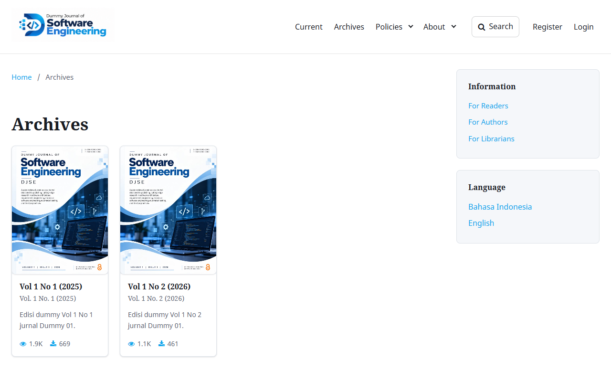
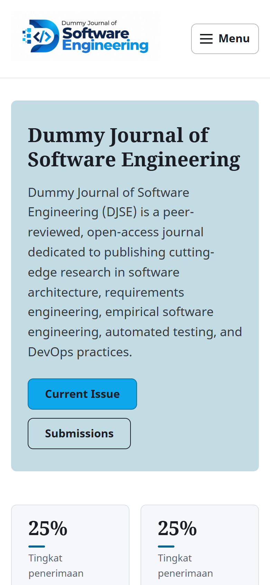
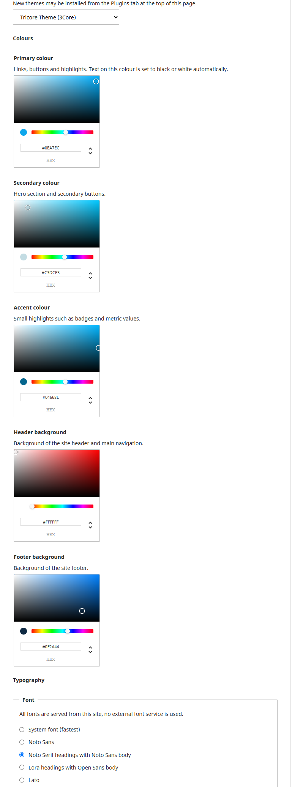

# Tricore Theme for OJS

A free, modern and accessible theme for [Open Journal Systems](https://pkp.sfu.ca/software/ojs/) 3.3, 3.4 and 3.5, made by [3Core](https://3core.web.id).

**[Live demo: demo.3core.web.id](https://demo.3core.web.id)**

Tricore follows the [PKP Theming Guide](https://docs.pkp.sfu.ca/pkp-theming-guide/en/): it is configured entirely from the OJS admin area (no code changes needed), keeps the OJS templates you rely on, and works as a parent theme for child themes.

## Features

- **Colour pickers** for the primary, secondary, accent, header and footer colours. Text on each colour switches to black or white automatically for readable contrast.
- **Typography**: system fonts or fonts served from your own OJS installation (Noto Sans, Noto Serif, Lora, Open Sans, Lato). No external font service.
- **Layout options**: header layout (logo left or centred), page width and corner rounding.
- **Journal homepage blocks**: hero with title, subtitle and two buttons, journal metrics (for example acceptance rate or review time), journal summary, latest articles, current issue and indexing information. Text options are multilingual.
- **Sidebar per page type**: show or hide the sidebar separately on the homepage, archive, issue, article, About, static, search and announcement pages.
- **Views and downloads** on article lists, the archive (total per issue) and the article page, taken from the OJS usage statistics.
- **Archive as a grid** of issue covers.
- **Site landing page** for multi-journal installations: journal cards with covers and ISSN, article search across all journals, and a sign-up call to action.
- **Redesigned login, registration and password reset pages.**
- **Social media links** in the footer.
- **Accessible**: visible keyboard focus, `aria-expanded` menus, reduced-motion support, right-to-left ready, print stylesheet.
- **Translations**: English and Indonesian.

## Screenshots

| Journal homepage | Archive |
|------------------|---------|
|  |  |
| **Article page** | **Mobile** |
|  |  |

**Theme options** (Settings > Website > Appearance > Theme)

## Requirements

| OJS | Branch | Release package | PHP |
|-----|--------|-----------------|-----|
| 3.3.x | [`stable-3_3_0`](https://github.com/anggriyulio/ojs-tricore-theme/tree/stable-3_3_0) | `tricore-<version>-ojs3.3.tar.gz` | 7.3 or later |
| 3.4.x | [`stable-3_4_0`](https://github.com/anggriyulio/ojs-tricore-theme/tree/stable-3_4_0) | `tricore-<version>-ojs3.4.tar.gz` | 8.0.2 or later |
| 3.5.x | [`stable-3_5_0`](https://github.com/anggriyulio/ojs-tricore-theme/tree/stable-3_5_0) (also `main`) | `tricore-<version>-ojs3.5.tar.gz` | 8.2 or later |

Each OJS version needs its own package: plugin classes, locale folders and some templates differ between versions. The default OJS theme (`plugins/themes/default`) must stay installed, because Tricore builds on its stylesheet and fonts. It does not need to be enabled.

## Installation

1. Download the package for your OJS version from [Releases](https://github.com/anggriyulio/ojs-tricore-theme/releases).
2. In OJS, go to **Settings > Website > Plugins > Upload A New Plugin** and upload the `.tar.gz` file.
   Alternatively, extract it to `plugins/themes/tricore` and run `php lib/pkp/tools/installPluginVersion.php plugins/themes/tricore/version.xml` from the OJS root.
3. Enable **Tricore Theme (3Core)** under **Settings > Website > Plugins**.
4. Select it under **Settings > Website > Appearance > Theme** and save. The theme options appear below the theme selector.

To use Tricore for the site landing page, do the same as Site Administrator under **Administration > Site Settings**.

See the [installation guide](docs/installation.md) for updating, uninstalling and troubleshooting.

## Documentation

- [Installation guide](docs/installation.md)
- [User guide](docs/user-guide.md): every theme option and page, for Journal Managers and Site Administrators
- [Changelog](CHANGELOG.md)

## Support

Found a bug or have an idea? Please [open an issue](https://github.com/anggriyulio/ojs-tricore-theme/issues) and include your OJS version, PHP version and the Tricore version shown under **Settings > Website > Plugins**.

Looking for more designs? The premium **Core Series** themes by [3Core](https://3core.web.id) are built on Tricore.

## License

Tricore is free software released under the [GNU General Public License v3](LICENSE), the same license as OJS. It uses the stylesheet and fonts of the OJS default theme (GPL v3, © Simon Fraser University).

Made by [3Core](https://3core.web.id) (Tricore Innovations).
